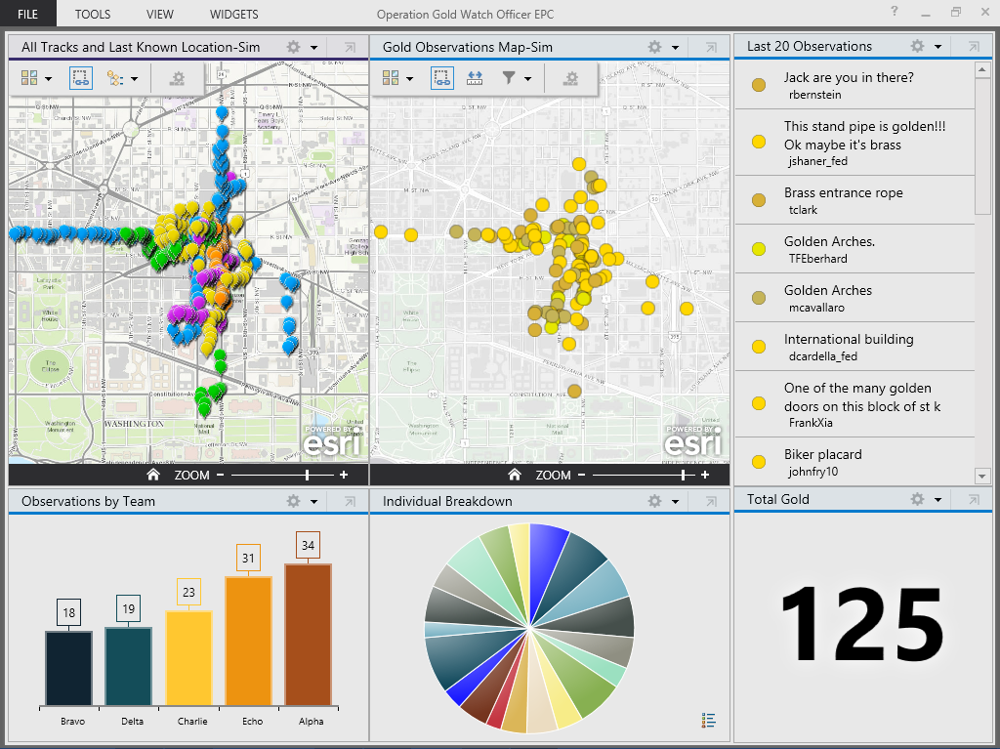

# solutions-widgets-wpf

The Solutions widgets (WPF) are examples of how to extend the [Operations Dashboard for ArcGIS](http://resources.arcgis.com/en/operations-dashboard/).  There are 8 Addins available to use as is or take and modify to meet your needs.

## Features

* Aircraft Communication Coverage Addin 
* Aircraft Route Generation Line Addin
* Bomb Threat Addin
* Farthest On Circle Addin
* Ground Communication Coverage Addin
* Order of Battle Addin
* Range Fan Addin
* Satellite Ephemeris Generation Addin

## Instructions

### General Help

* [New to Github? Get started here.](http://htmlpreview.github.com/?https://github.com/Esri/esri.github.com/blob/master/help/esri-getting-to-know-github.html)

### Getting Started with the Solution Widgets (WPF)
* Open, build, and add one of the addins to the Operations Dashboard
* Check the readme for each addin to get more details about what each one does.

## Requirements

* ArcGIS Runtime SDK for WPF 10.2, included in the SDK is a copy of the Operations Dashboard
 
### Services

* There are several services that the addins depend on to function.  You can open, build, and run the TestDependentServices solution to check which services may not be available.

## Resources

* Learn more about Esri's [ArcGIS for the Military](http://solutions.arcgis.com/military/).
* These widgets use [Esri's ArcGIS Runtime SDK for WPF](http://resources.arcgis.com/en/communities/runtime-wpf/);
see the site for concepts, samples, and references for using the API to create mapping applications.

## Issues

Find a bug or want to request a new feature?  Please let us know by submitting an issue.

## Contributing

Anyone and everyone is welcome to contribute.

## Licensing

Copyright 2012 Esri

Licensed under the Apache License, Version 2.0 (the "License");
you may not use this file except in compliance with the License.
You may obtain a copy of the License at

   [http://www.apache.org/licenses/LICENSE-2.0](http://www.apache.org/licenses/LICENSE-2.0)

Unless required by applicable law or agreed to in writing, software
distributed under the License is distributed on an "AS IS" BASIS,
WITHOUT WARRANTIES OR CONDITIONS OF ANY KIND, either express or implied.
See the License for the specific language governing permissions and
limitations under the License.

A copy of the license is available in the repository's
[license.txt](license.txt) file.

