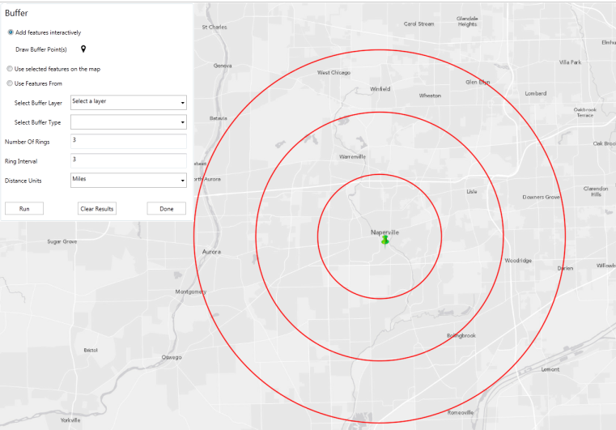

# Buffer Features Map Tool

The Buffer map tool generates buffers at specified distance and rings.  This addin is built as a Map Tool with a Toolbar for the [Operations Dashboard for ArcGIS](http://resources.arcgis.com/en/operations-dashboard/).  The addin can be added as a Map Tool on a Map Widget.  No data is required to run the tool.

## Features

* Creates buffer polygons based on specified distance and ring intervals. You can create buffers around
1. Points you draw on the map (draw points on the map using draw points button)
2. Selected features on the map (you must select features on the map first) 
3. Selected features that meet attribute criteria from a specified layer
   You must specify a layer and a field name in the map tool settings dialog box. This option lets you create buffer around features that meet your criteria from the specified layer (attribute selection from a layer).   

## Instructions
1. "Add features interactively" option can be used to create buffers around points you have drawn on the map. 
2. "Use selected features on the map" option can be used if you want to create buffer around the selected features on the map.
    Features must be selected on the map for this option to work. 
3. "Use Features From" option can be used to create buffer around features that meet attribute criteria. You must configure the map tool to specify a layer and field name in the map tool settings dialog box. The tool will create buffers around features from the selected layer that match selection criteria. 

### General Help

* [New to Github? Get started here.](http://htmlpreview.github.com/?https://github.com/Esri/esri.github.com/blob/master/help/esri-getting-to-know-github.html)

### Getting Started with this addin
* Open, build, and add the addin to the Operations Dashboard
* Add as a Map tool to a Map Widget
* Specify your parameters and run the tool.

## Requirements

* Visual Studio 2012
* ArcGIS Runtime SDK for WPF 10.2, included in the SDK is a copy of the Operations Dashboard
* ArcGIS Geometry Service is required - http://tasks.arcgisonline.com/ArcGIS/rest/services/Geometry/GeometryServer
 
### Services

* If you are using your own portal behind the firewall and cannot reach ArcGIS Online you will need to modify the service url to point to your own service.
* ArcGIS Geometry Service is required - http://tasks.arcgisonline.com/ArcGIS/rest/services/Geometry/GeometryServer

## Resources

* Learn more about the [Operations Dashboard for ArcGIS](http://resources.arcgis.com/en/operations-dashboard/)
* These widgets use [Esri's ArcGIS Runtime SDK for WPF](http://resources.arcgis.com/en/communities/runtime-wpf/);
see the site for concepts, samples, and references for using the API to create mapping applications.

## Issues

Find a bug or want to request a new feature?  Please let us know by submitting an issue.

## Contributing

Esri welcomes contributions from anyone and everyone. Please see our [guidelines for contributing](https://github.com/esri/contributing).

## Licensing

Copyright 2012 Esri

Licensed under the Apache License, Version 2.0 (the "License");
you may not use this file except in compliance with the License.
You may obtain a copy of the License at

   [http://www.apache.org/licenses/LICENSE-2.0](http://www.apache.org/licenses/LICENSE-2.0)

Unless required by applicable law or agreed to in writing, software
distributed under the License is distributed on an "AS IS" BASIS,
WITHOUT WARRANTIES OR CONDITIONS OF ANY KIND, either express or implied.
See the License for the specific language governing permissions and
limitations under the License.

A copy of the license is available in the repository's
[license.txt](license.txt) file.

