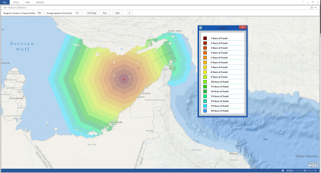

# Farthest On Circle Addin

Calculates the farthest on circle for a vessel. The farthest on circle allows an analyst to understand how far a vessel can get in an amount of time. Output is in hours. A typical use case of the tool is understanding how far a submarine could get in an amount of time, after contact is lost. The tool could also be run in the case of fast vessels by changing the speed parameter to reflect a faster speed.  This addin is built as a Map Tool with a Toolbar for the [Operations Dashboard for ArcGIS](http://resources.arcgis.com/en/operations-dashboard/).  The addin can be added as a Map Tool on a Map Widget.  

## Features

* Calculates how far a vessel can get based on an amount of time. 
* Configure the addin without recompiling to point to your own Farthest On Circle geoprocessing service. 

## Instructions

### General Help

* [New to Github? Get started here.](http://htmlpreview.github.com/?https://github.com/Esri/esri.github.com/blob/master/help/esri-getting-to-know-github.html)

### Getting Started with this addin
* Open, build, and add the addin to the Operations Dashboard
* Add as a Map tool to a Map Widget
* For this map tool, you click on the map of where you lost contact with the vessel and can modify the speed based on the type of vessel and then click run to execute the geoprocessing service

## Requirements

* Visual Studio 2012
* ArcGIS Runtime SDK for WPF 10.2, included in the SDK is a copy of the Operations Dashboard
 
### Services

* A geoprocessing service is required, currently this service is running at: [Farthest On Circle Service](http://afmcloud.esri.com/arcgis/rest/services/Tasks/FarthestOnCircle/GPServer/Farthest%20On%20Circle)
* If you are unable to reach the above service.  You can download the geoprocessing package from ArcGIS Online [here](http://www.arcgis.com/home/item.html?id=04e865ad157f4f3f9b1cdc37a6c0f0bf) and stand up your own Farthest On Circle geoprocessing service.

## Resources

* Learn more about the [Operations Dashboard for ArcGIS](http://resources.arcgis.com/en/operations-dashboard/)
* Learn more about Esri's [ArcGIS for the Military](http://solutions.arcgis.com/military/).
* These widgets use [Esri's ArcGIS Runtime SDK for WPF](http://resources.arcgis.com/en/communities/runtime-wpf/);
see the site for concepts, samples, and references for using the API to create mapping applications.

## Issues

Find a bug or want to request a new feature?  Please let us know by submitting an issue.

## Contributing

Esri welcomes contributions from anyone and everyone. Please see our [guidelines for contributing](https://github.com/esri/contributing).

## Licensing

Copyright 2012-2013 Esri

Licensed under the Apache License, Version 2.0 (the "License");
you may not use this file except in compliance with the License.
You may obtain a copy of the License at

   [http://www.apache.org/licenses/LICENSE-2.0](http://www.apache.org/licenses/LICENSE-2.0)

Unless required by applicable law or agreed to in writing, software
distributed under the License is distributed on an "AS IS" BASIS,
WITHOUT WARRANTIES OR CONDITIONS OF ANY KIND, either express or implied.
See the License for the specific language governing permissions and
limitations under the License.

A copy of the license is available in the repository's
[license.txt](license.txt) file.

