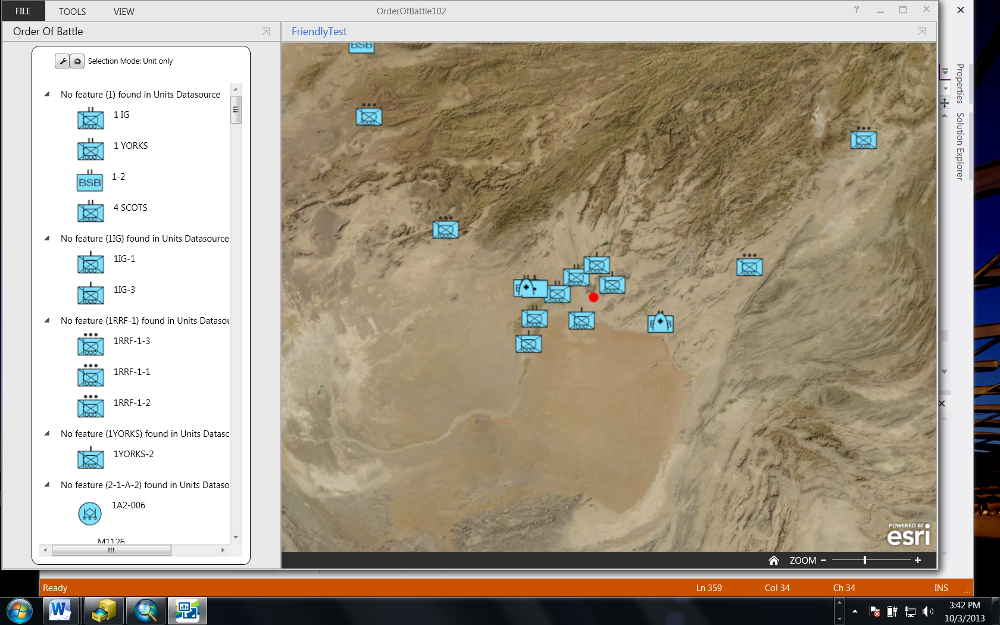

# Order of Battle Addin

The Order of Battle Widget organizes data layers (units and equipment) into hierarchical structures using a schema defined for military features.  While the tool is designed to represent military units and equipment, any features adhering to the military features schema for units and equipment may be represented in the Order of Battle widget.

## Features

* Configure the widget when you add it to an operation view.  
* Select A Units feature layer to represent the parent hierarchical structure
* Add layers to represent equipment or items owned by the Units

## Instructions

### General Help

* [New to Github? Get started here.](http://htmlpreview.github.com/?https://github.com/Esri/esri.github.com/blob/master/help/esri-getting-to-know-github.html)

### Getting Started with this addin

* Open, build, and add the addin to the Operations Dashboard
* Add the widget to an Operational View
* Configure the widget:

1.	Type a title for your Order of Battle
2.	Add an optional description
3.	Select a datasource from the list of layers in the webmap.  
4.	Type a name representing the datasource.  The first data source added to the Order of Battle should represent units or forces.  Its name, 'Units' is not editable.
5.	Select the unique identifier (UID) field (for military features  this is 'Unique Designation')
6.	Select the higher formation field (for military feature force elements the Higher formation field is 'Higher Formation' for equipment it is 'Owning Unit').
7.	Select a field or type a label for features that will be displayed for features in that data source in the Order of Battle tree view.
8.	Use the radio button to select whether the feature's symbol is displayed in the Order of Battle tree view.
9.	Use the radio buttons to select whether a description will be displayed in the tree view.  The user may choose to display no description, a single field or a custom description.
10.	Click the 'Add' button to add the datasource to the order of battle.  
11.	The user may optionally configure additional datasources to the Order of Battle by repeating steps 3-10
12.	Click on the Feature Actions Tab and select feature actions accessible from the context 
13. Add Feature Actions actions to items in the Order of Battle
14.	Click OK to create the Order of Battle	

## Requirements

* Visual Studio 2012
* ArcGIS Runtime SDK for WPF 10.2, included in the SDK is a copy of the Operations Dashboard

## Schema Requirements

* Unit elements, such as military feature force elements, elements must have a field with a unique identifier (in Esri military features unit feature classes this is the uniquedesignation field) and a second field that points to the unique identifier of another feature that represents the next higher unit in the hierarchy (in Esri military features unit feature classes this is the higherformation field).
* Dependent elements, such as equipment owned by units, is represented by a unique identifier (in Esri military features equipment feature classes this field is uniquedesignatiom) and the owning unit in the units feature class (in Esri military features equipment feature classes this field is owningunit).
* For examples of this schema, you may download sample layer packages from [ArcGIS.com](http://www.arcgis.com/home/item.html?id=17bbffb9459d4d1ca5078106a894a076) or consult the [military features help](http://resources.arcgis.com/en/help/main/10.1/index.html#//000n00000012000000)
 
### Services

* See [Getting Started](#getting-started-with-this-addin) for the data source dependencies

## Resources

* Learn more about the [Operations Dashboard for ArcGIS](http://resources.arcgis.com/en/operations-dashboard/)
* Learn more about Esri's [ArcGIS for the Military](http://solutions.arcgis.com/military/).
* These widgets use [Esri's ArcGIS Runtime SDK for WPF](http://resources.arcgis.com/en/communities/runtime-wpf/);
see the site for concepts, samples, and references for using the API to create mapping applications.

## Issues

Find a bug or want to request a new feature?  Please let us know by submitting an issue.

## Contributing

Esri welcomes contributions from anyone and everyone. Please see our [guidelines for contributing](https://github.com/esri/contributing).

## Licensing

Copyright 2012-2013 Esri

Licensed under the Apache License, Version 2.0 (the "License");
you may not use this file except in compliance with the License.
You may obtain a copy of the License at

   [http://www.apache.org/licenses/LICENSE-2.0](http://www.apache.org/licenses/LICENSE-2.0)

Unless required by applicable law or agreed to in writing, software
distributed under the License is distributed on an "AS IS" BASIS,
WITHOUT WARRANTIES OR CONDITIONS OF ANY KIND, either express or implied.
See the License for the specific language governing permissions and
limitations under the License.

