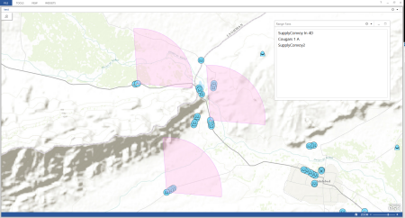

# Range Fan Addin

The main function of this addin is to create range fans for features from the bearing, traversal, and range specified in the configuration of the widget. The addin also allows for managing the fans that are created with a widget containing of list of the features that have fans.  You can remove a range fan from the widget using the feature action remove fan.  This addin is contains a widget and two feature actions for the [Operations Dashboard for ArcGIS](http://resources.arcgis.com/en/operations-dashboard/).  If the datasource is dynamic the range fan will update as the features location changes.

## Features

* Configure the widget when you add it to an operation view.  
* Use the Create Range Fan Feature Action on a feature to create the range fan and it will get added to the widget list.  
* Use the Remove Range Fan feature action to remove the range fan from the widget list. 

## Instructions

### General Help

* [New to Github? Get started here.](http://htmlpreview.github.com/?https://github.com/Esri/esri.github.com/blob/master/help/esri-getting-to-know-github.html)

### Getting Started with this addin
* Open, build, and add the addin to the Operations Dashboard
* Add the widget to an Operational View
* Configure the widget:
	1. **Title**: This is the title of the widget which is your list of range fans that you have created
	2. **Data Source**:  This is the datasource that you are using to create range fans on.
	3. **Field**:  A unique identifier that you want to show in the range fan widget list to help you know what unit you have created a range fan
	4. **Feature Actions**: These are the features actions that will work with the list of range fans in the widget. One in particular that you will want to add is the Remove Range Fan feature action to allow you to remove the graphics.
	5. **Bearing**: Bearing to use when creating range fan
	6. **Traversal**: Traversal to use when creating range fan
	7. **Range**:  Range to use when creating range fan
	8. **Map Widget**:  The widget that the fans will be added too
* The Create Range Fan Feature Action and the Remove Range Fan Feature Action can be added as a capability on the map or any where you can add a feature action.
* When you click on a feature that has the create range fan feature action available.  A range fan will be created and the feature will be added to the widget list.  Use the Remove range fan feature action to remove it from the list.

## Requirements

* Visual Studio 2012
* ArcGIS Runtime SDK for WPF 10.2, included in the SDK is a copy of the Operations Dashboard
 
### Services

* No services are needed for this widget.

## Resources

* Learn more about the [Operations Dashboard for ArcGIS](http://resources.arcgis.com/en/operations-dashboard/)
* Learn more about Esri's [ArcGIS for the Military](http://solutions.arcgis.com/military/).
* These widgets use [Esri's ArcGIS Runtime SDK for WPF](http://resources.arcgis.com/en/communities/runtime-wpf/);
see the site for concepts, samples, and references for using the API to create mapping applications.

## Issues

Find a bug or want to request a new feature?  Please let us know by submitting an issue.

## Contributing

Esri welcomes contributions from anyone and everyone. Please see our [guidelines for contributing](https://github.com/esri/contributing).

## Licensing

Copyright 2012-2013 Esri

Licensed under the Apache License, Version 2.0 (the "License");
you may not use this file except in compliance with the License.
You may obtain a copy of the License at

   [http://www.apache.org/licenses/LICENSE-2.0](http://www.apache.org/licenses/LICENSE-2.0)

Unless required by applicable law or agreed to in writing, software
distributed under the License is distributed on an "AS IS" BASIS,
WITHOUT WARRANTIES OR CONDITIONS OF ANY KIND, either express or implied.
See the License for the specific language governing permissions and
limitations under the License.

A copy of the license is available in the repository's
[license.txt](license.txt) file.

