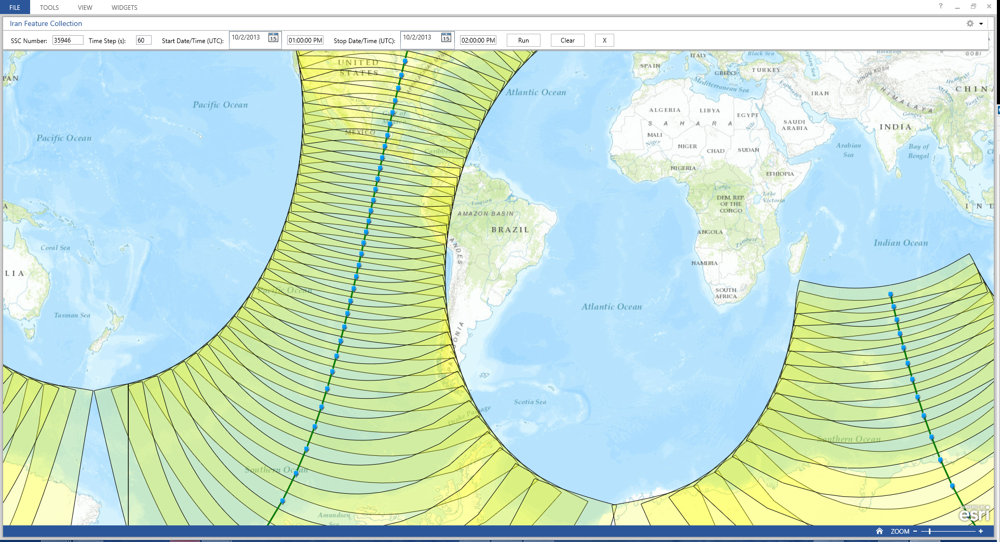

# Satellite Ephemeris Generation Addin

The Satellite Ephemeris  generates the ephemeris for a satellite using the AGI application server. Also generates the corresponding sensor swath.  This addin is built as a Map Tool with a Toolbar for the [Operations Dashboard for ArcGIS](http://resources.arcgis.com/en/operations-dashboard/).  The addin can be added as a Map Tool on a Map Widget.  No data is required to run the tool.

## Features

* Shows the ephemeris for a satellite.

## Instructions

### General Help

* [New to Github? Get started here.](http://htmlpreview.github.com/?https://github.com/Esri/esri.github.com/blob/master/help/esri-getting-to-know-github.html)

### Getting Started with this addin
* Open, build, and add the addin to the Operations Dashboard
* Add as a Map tool to a Map Widget
* For this map tool, you will enter the SSC number for the satellite you are interested in, timestep, and date/time and it will generate the ephemeris for that satellite.

## Requirements

* Visual Studio 2012
* ArcGIS Runtime SDK for WPF 10.2, included in the SDK is a copy of the Operations Dashboard
 
### Services

* A dependent web service is required: : Satellite Ephemeris Generation. See the source for more information.

## Resources

* Learn more about the [Operations Dashboard for ArcGIS](http://resources.arcgis.com/en/operations-dashboard/)
* Learn more about Esri's [ArcGIS for the Military](http://solutions.arcgis.com/military/).
* These widgets use [Esri's ArcGIS Runtime SDK for WPF](http://resources.arcgis.com/en/communities/runtime-wpf/);
see the site for concepts, samples, and references for using the API to create mapping applications.
* Learn more about [AGI](http://www.agi.com/default.aspx)

## Issues

Find a bug or want to request a new feature?  Please let us know by submitting an issue.

## Contributing

Esri welcomes contributions from anyone and everyone. Please see our [guidelines for contributing](https://github.com/esri/contributing).

## Licensing

Copyright 2012 Esri

Licensed under the Apache License, Version 2.0 (the "License");
you may not use this file except in compliance with the License.
You may obtain a copy of the License at

   [http://www.apache.org/licenses/LICENSE-2.0](http://www.apache.org/licenses/LICENSE-2.0)

Unless required by applicable law or agreed to in writing, software
distributed under the License is distributed on an "AS IS" BASIS,
WITHOUT WARRANTIES OR CONDITIONS OF ANY KIND, either express or implied.
See the License for the specific language governing permissions and
limitations under the License.

A copy of the license is available in the repository's
[license.txt](license.txt) file.

